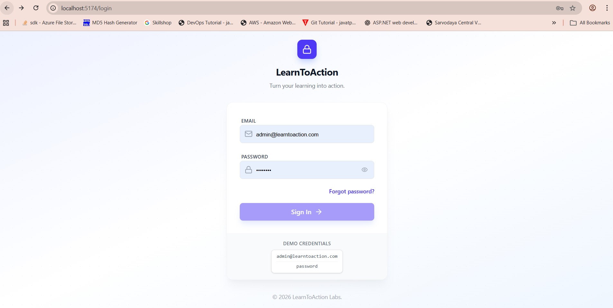
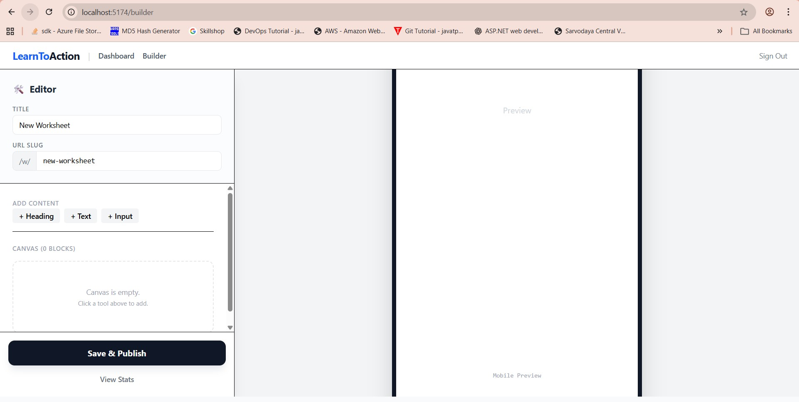
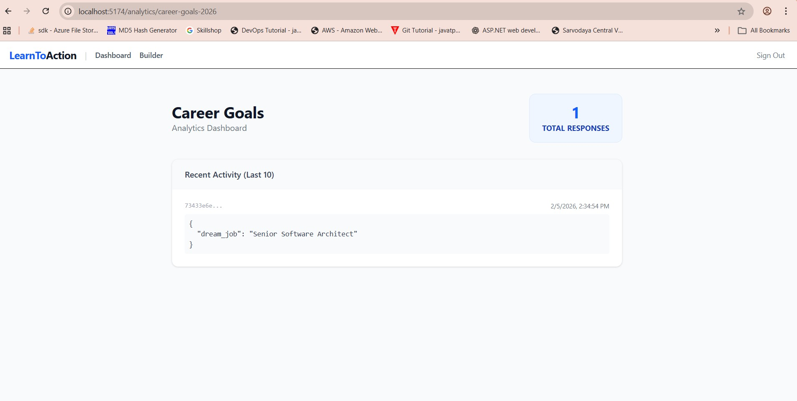

# LearnToAction: MVP Status Report 🚀

**Date:** February 05, 2026
**Version:** Tier 1 (MVP)
**Status:** ✅ Ready for Pilot

---

## 📋 Executive Summary
We have successfully built and validated the **Tier 1 MVP** for LearnToAction. The system is functional, deployed locally, and ready for internal testing or pilot user onboarding.
All 7 planned modules are complete.

---

## 🎨 Feature Showcase

### 1. Authentication & Security
*   **Status:** ✅ Complete
*   **Features:** Secure email/password login, session management, route protection.
*   **Screenshot:**
    

### 2. Worksheet Builder (Teacher View)
*   **Status:** ✅ Complete
*   **Features:**
    *   Create unlimited worksheets.
    *   Add text, headings, and various input types (Text, Number, Rating, etc.).
    *   **New:** Link worksheets together ("Workbook Flow").
*   **Screenshot:**
    

### 3. Student Experience (The "Action" Part)
*   **Status:** ✅ Complete
*   **Features:**
    *   Mobile-first, vertical scroll design.
    *   **Autosave:** Answers are saved instantly as you type.
    *   **Course Flow:** Automatically redirects to the next worksheet upon completion.
*   **Screenshot:**
    

### 4. Insights & Analytics
*   **Status:** ✅ Complete
*   **Features:**
    *   View real-time response counts.
    *   See recent submissions.
*   **Screenshot:**
    

---

## 🛠️ Technical Modules Status

| Module | Feature | Status | Notes |
| :--- | :--- | :--- | :--- |
| **1** | **Authentication** | ✅ **Done** | Admin user seeded. |
| **2** | **Workspace** | ✅ **Done** | Single-tenant isolation. |
| **3** | **Runtime** | ✅ **Done** | Optimized for mobile. |
| **4** | **Builder** | ✅ **Done** | Sidebar editor + Preview. |
| **5** | **Workbook Flow** | ✅ **Done** | "Next Worksheet" logic added. |
| **6** | **Persistence** | ✅ **Done** | Debounced API autosave. |
| **7** | **Insights** | ✅ **Done** | Basic stats dashboard. |

---

## 🚀 Next Steps
1.  **Deploy:** Move from Localhost to a cloud server (AWS/Vercel).
2.  **Pilot:** Onboard first 5 "Teacher" users.
3.  **Feedback:** Gather student feedback on the "Vertical Scroll" vs "One-by-One" layout.
